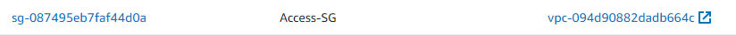

# Creating-EC2-Instance-and-Installing-Jenkins-with-Terraform

## Prerequisites

Install [Terraform](https://developer.hashicorp.com/terraform/tutorials/aws-get-started/install-cli)

Install [AWS Cli](https://docs.aws.amazon.com/cli/latest/userguide/getting-started-install.html)

## EC2-Infos

Some EC2 infos at ``` variables.tf ``` :

instance_type used : [t2.small](https://aws.amazon.com/pt/ec2/instance-types/t2/)

availability_zone : [us-east-1a](https://aws.amazon.com/pt/about-aws/global-infrastructure/regions_az/)

ami (Amazon Machine Image) : [Ubuntu Server 22.04 LTS](https://docs.aws.amazon.com/pt_br/AWSEC2/latest/UserGuide/AMIs.html)


**Be Careful - Use the same region for Availability Zone and AMI**


## UserData (Bootstrap)

With userdata we can install and update softwares and SO right after booting.
At this case, some softwares are installed, updated and started.

## Security Group

A security group named ```Access-SG``` are created, and 3 Inbound Rules:

```HTTP Port 8080``` for Jenkins Access.

```HTTPS Port 443``` for Virtual Endpoint.

```SSH Port 22``` for SSH Connection.




## Keypair

A Keypair with ```RSA-4096``` Encryption method is created.

**Sometimes you can receive an error about Keypair, only try again.**


## Jenkins Password

After EC2 started, connect via SSH or EC2 Instance Connect.

Use ```systemctl jenkins status``` to receive your jenkins password.


## Terraform

```terraform init``` 

```terraform apply -auto-approve ```

```terraform destroy -auto-approve ```

